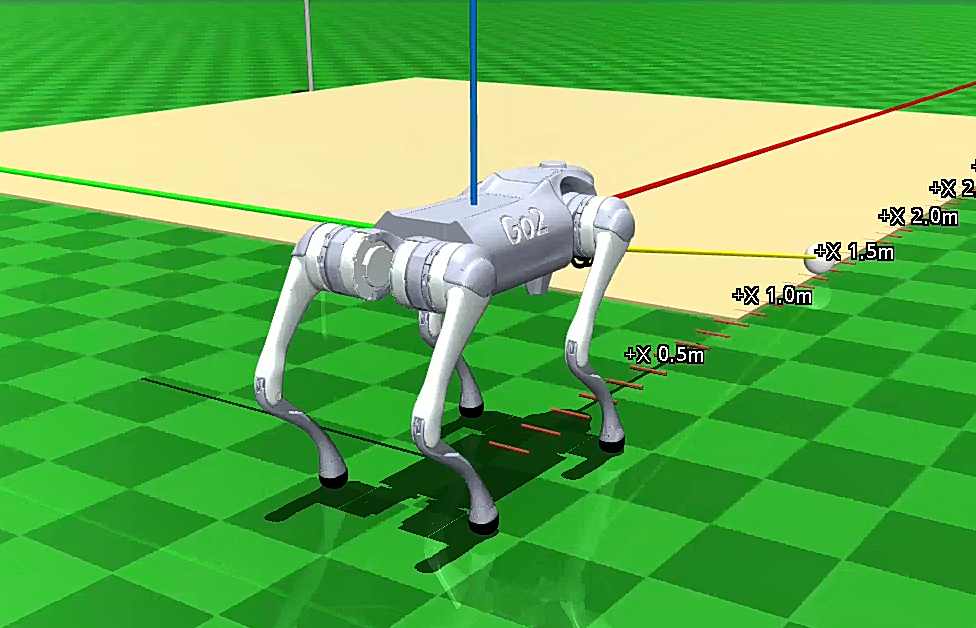
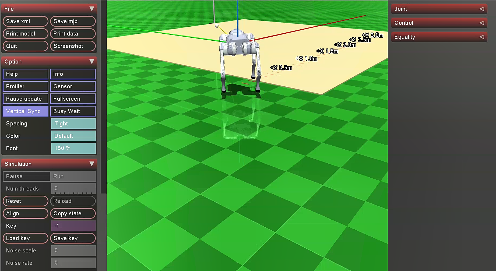

# WSO2 Caddie ROS 2 Simulation — Setup & Usage Guide

A ROS 2 Jazzy simulation workspace for an autonomous robotic golf caddie, based on the Unitree Go2 Edu MVP proposal.

---

## 1. Overview

<table>
<tr>
<td width="50%"></td>
<td width="50%"></td>
</tr>
</table>


This workspace simulates an autonomous robotic caddie built on the **Unitree Go2 Edu** quadruped platform. It supports **two independent simulation pipelines**:

1. **Standard Gazebo Sim** — visual leg animations, easier to run, good for navigation/perception testing.
2. **High-fidelity MuJoCo Sim + Zenoh Middleware** — custom holonomic trot kinematics, precise leg-ground contact physics.

### Core capabilities (from the proposal)
- Unitree Go2 Edu quadruped platform for terrain agility
- Autonomous course navigation using ROS 2, SLAM, and Nav2
- RGB-D vision with YOLO + VLM-style scene reasoning for golf-ball tracking
- LLM/voice command interaction
- Golf equipment logistics, ball retrieval, and shot analytics
- MVP payload awareness (the bag rack is a research payload, not a production loadout)

> The original proposal PDF is image-based; the requirements above are reflected directly in this workspace's code and packages.

---

## 2. Package Layout

```
src/
  go2_description/          Official Unitree Go2 URDF meshes/assets, ROS 2 packaged
  unitree_api/               Official Unitree ROS 2 API message definitions
  unitree_go/                 Official Unitree Go2 ROS 2 message definitions
  caddie_unitree_official/   Official Unitree MuJoCo Go2 model/assets & custom Zenoh controller
  caddie_description/        Go2 caddie URDF/Xacro and controller config
  caddie_gazebo/              Gazebo Sim course world and ROS-GZ bridge launch
  caddie_navigation/          SLAM Toolbox, Nav2 params, RViz config
  caddie_perception/          YOLO/OpenCV golf-ball detector and VLM context node
  caddie_interaction/         Vosk-style voice node and conversational router
  caddie_core/                 Main autonomous caddie orchestration node
  caddie_control/              Optional velocity limiter / Unitree SDK adapter point
  caddie_bringup/              One-command simulation bringup
```

### Official Unitree Integration
This workspace vendors official Unitree assets where they fit ROS 2 Jazzy / Gazebo Sim / MuJoCo:

| Package | Source |
|---|---|
| `go2_description` | Official Go2 URDF, DAE meshes, control config — [unitree_ros](https://github.com/unitreerobotics/unitree_ros) |
| `unitree_api`, `unitree_go` | Official ROS 2 message packages (SDK2/SportMode API) — [unitree_ros2](https://github.com/unitreerobotics/unitree_ros2) |
| `caddie_unitree_official/mujoco/go2` | Official MuJoCo Go2 XML/terrain scenes, extended with a standalone Zenoh Python controller (`run_dog.py`) — [unitree_mujoco](https://github.com/unitreerobotics/unitree_mujoco) |
| `caddie_description/urdf/go2_caddie_official.urdf.xacro` | Extends the official Go2 body with caddie payload, RGB-D camera, lidar, IMU, and Gazebo Sim plugins |

---

## 3. Installation

### Step 3.1 — Standard ROS 2 Jazzy & Gazebo Prerequisites
```bash
sudo apt update
sudo apt install -y \
  ros-jazzy-desktop \
  ros-jazzy-ros-gz \
  ros-jazzy-ros-gz-bridge \
  ros-jazzy-ros-gz-sim \
  ros-jazzy-navigation2 \
  ros-jazzy-nav2-bringup \
  ros-jazzy-slam-toolbox \
  ros-jazzy-xacro \
  ros-jazzy-tf2-geometry-msgs \
  python3-colcon-common-extensions \
  python3-rosdep
```

### Step 3.2 — Zenoh Middleware & MuJoCo Requirements
```bash
# ROS 2 Zenoh RMW backend
sudo apt install -y ros-jazzy-rmw-zenoh-cpp

# Python requirements for standalone MuJoCo tracking
pip3 install mujoco mujoco-python-viewer eclipse-zenoh --break-system-packages opencv-python numpy ultralytics vosk sounddevice
```

> **Notes:**
> - `ultralytics` is only needed for YOLO. If `yolo_model` is empty or the package is missing, the detector automatically falls back to the OpenCV white/circular golf-ball detector.
> - `vosk` and `sounddevice` are only needed for microphone input — text commands work without them.

### Step 3.3 — Build the Workspace
```bash
cd /media/nimsika/WindowsData/ros2/WSO2-caddie-project
source /opt/ros/jazzy/setup.bash
rosdep install --from-paths src --ignore-src -r -y
colcon build --symlink-install
source install/setup.bash
```

---

## 4. Pipeline 1 — Full Gazebo Simulation

### Step 4.1 — Launch
```bash
ros2 launch caddie_bringup caddie_sim.launch.py
```

### Step 4.2 — Useful Launch Options
| Option | Effect |
|---|---|
| `gui:=false` | Run headless (no Gazebo GUI) |
| `use_rviz:=false` | Disable RViz |
| `detector_backend:=opencv` | Force OpenCV fallback detector |
| `yolo_model:=/path/to/golf_ball_yolo.pt` | Use a custom YOLO model |
| `use_voice:=true` | Enable microphone voice input |
| `use_unitree_sport_bridge:=true` | Enable official Unitree SportMode bridge |
| `use_leg_animation:=false` | Disable visible leg animation |

Example:
```bash
ros2 launch caddie_bringup caddie_sim.launch.py gui:=false use_rviz:=false
```

---

## 5. Pipeline 2 — High-Fidelity MuJoCo + Zenoh Simulation

This mode bypasses the standard heavy simulation nodes to track precise leg-ground contacts, using custom **Omnidirectional Sine-Wave Trot Kinematics** mapped directly over standard ROS 2 `/cmd_vel` inputs, bridged through Zenoh.

### Step 5.1 — Start the Zenoh Router
```bash
ros2 run rmw_zenoh_cpp rmw_zenohd
```

### Step 5.2 — Start the MuJoCo Walk Bridge Controller
```bash
cd /media/nimsika/WindowsData/ros2/WSO2-caddie-project
source install/setup.bash
cd src/caddie_unitree_official/mujoco/go2
python3 run_dog.py
```
The Go2 platform spawns in a stable horizontal stance (`Kp=160.0`, `Kd=8.0`), balancing its internal floating-base frames.

### Step 5.3 — Publish Velocity Commands (New Terminal)
Each command below requires the Zenoh RMW to be set explicitly first:
```bash
export RMW_IMPLEMENTATION=rmw_zenoh_cpp
```

**Walk forward / backward:**
```bash
ros2 topic pub --once /cmd_vel geometry_msgs/msg/Twist "{linear: {x: 0.3, y: 0.0, z: 0.0}}"
```
*(Backward motion uses absolute `abs(vx)` scaling to protect calf clearance.)*

**Lateral side-steps (crab-walking):**
```bash
ros2 topic pub --once /cmd_vel geometry_msgs/msg/Twist "{linear: {x: 0.0, y: 0.2, z: 0.0}}"
```

**Pivot turning (fixed pivot yaw kinematics):**
```bash
ros2 topic pub --once /cmd_vel geometry_msgs/msg/Twist "{linear: {x: 0.0, y: 0.0, z: 0.0}, angular: {x: 0.0, y: 0.0, z: 0.4}}"
```
*(Custom cross-mapping: left flank joints actuate sideways along Y; right flank segments stroke forward along X.)*

---

## 6. Autonomous Task Commands

### Text Command Topic (always available, no voice needed)
```bash
ros2 topic pub --once /caddie/text_command std_msgs/msg/String "{data: 'start mapping'}"
ros2 topic pub --once /caddie/text_command std_msgs/msg/String "{data: 'retrieve nearest ball'}"
ros2 topic pub --once /caddie/text_command std_msgs/msg/String "{data: 'list balls'}"
ros2 topic pub --once /caddie/text_command std_msgs/msg/String "{data: 'analyze shot'}"
ros2 topic pub --once /caddie/text_command std_msgs/msg/String "{data: 'return home'}"
ros2 topic pub --once /caddie/text_command std_msgs/msg/String "{data: 'stop'}"
```

### Free-Form Conversational Router
```bash
ros2 topic pub --once /caddie/conversation_text std_msgs/msg/String "{data: 'please find the closest lost golf ball'}"
ros2 topic pub --once /caddie/conversation_text std_msgs/msg/String "{data: 'take me back to the tee box'}"
```

### Status Topics to Monitor
```bash
ros2 topic echo /caddie/status
ros2 topic echo /caddie/ball_detections
ros2 topic echo /go2/gait_status
```

---

## 7. Understanding the Go2 Simulation Model

- The default URDF/Xacro is based on the official Unitree Go2 description.
- For robust Nav2 simulation, the model uses **hidden tiny drive wheels** under the body plus Gazebo's diff-drive plugin to consume `/cmd_vel` and publish `/odom`.
- By default, the **visible legs are animated** via `gz_ros2_control`, while the hidden wheels handle actual odometry and base movement. The animated legs are **visual-only** — their feet don't strike the ground or tip the robot.

### Gait Animator Behavior
Subscribes to `/cmd_vel`, `/odom`, and `/imu`, and adapts stride length, step frequency, stance width, and foot lift based on course surface:

| Surface | Behavior |
|---|---|
| Fairway | Normal trot |
| Green | Short, gentle steps |
| Tee | Cautious startup stance |
| Rough | Shorter stride, extra lift |
| Sand bunker | Slower, high-clearance steps |
| Mound/slope | Wider stance with pitch/roll compensation |

### Disable Leg Animation
```bash
ros2 launch caddie_bringup caddie_sim.launch.py use_leg_animation:=false
```

### Tune the Gait Live (After Launch)
```bash
ros2 param set /go2_gait_animator max_step_frequency 0.55
ros2 param set /go2_gait_animator max_thigh_swing 0.045
ros2 param set /go2_gait_animator max_calf_swing 0.032
ros2 param set /go2_gait_animator trajectory_time 0.70
```
> Note: this gait animator is a **visualizer only** — it is not Unitree's production locomotion controller.

---

## 8. Optional Control Nodes

### Velocity Limiter
Useful when feeding commands from Nav2 or teleop:
```bash
ros2 run caddie_control go2_velocity_limiter --ros-args -p input_topic:=/cmd_vel_raw -p output_topic:=/cmd_vel
```

### Unitree SportMode Bridge
Publishes official `unitree_api/Request` messages to `/api/sport/request`:
```bash
ros2 run caddie_control unitree_sportmode_bridge
```
> ⚠️ Only use this bridge when the Unitree ROS 2 middleware or robot-side SDK agent is actually available. In Gazebo Sim, keep `use_unitree_sport_bridge:=false` unless specifically testing message flow.

---

## 9. Quick Reference — Send a Single Test Command
```bash
ros2 topic pub /caddie/text_command std_msgs/msg/String "data: 'hit'" --once
```
Expected output:
```
publisher: beginning loop
publishing #1: std_msgs.msg.String(data='hit')
```

---

## 10. Recommended Quick-Start Order

1. Install prerequisites (§3.1–3.2)
2. Build workspace (§3.3)
3. Choose a pipeline:
   - **Gazebo (easier):** run §4.1, then send commands from §6
   - **MuJoCo + Zenoh (high-fidelity):** run §5.1 → §5.2 → §5.3, then send commands from §6
4. Monitor via status topics (§6)
5. Tune gait/leg animation as needed (§7)
